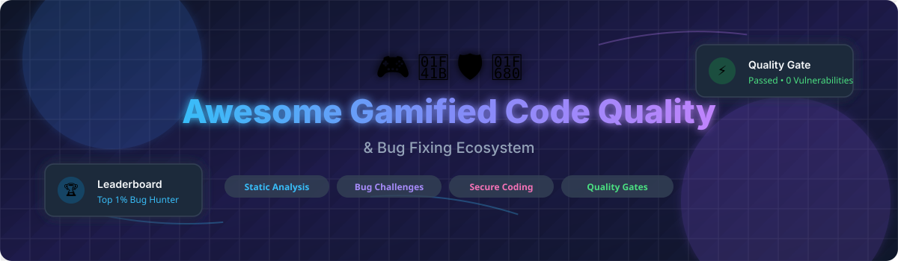

# Awesome-Gamified-Code-Quality-Bug-Fixing

# Awesome-Gamified-Code-Quality-Bug-Fixing 🎮 🐛

  

  

  

  

  

  

  

---

## 🌟 Top Gamified Code Quality & Bug Fixing Ecosystem

**Curated List of Commercial Code Quality Platforms & Open-Source Static Analysis Tools**  

*Focused on Gamified Bug Busting, Static Analysis, Code Review Automation, Secure Coding Training, Leaderboards & Self-Hosted Quality Gates*

**Last updated: October 2026** 📅

---

### 📌 Overview & SEO Summary

Welcome to the ultimate curated directory of **gamified code quality platforms**, **open-source static analysis tools**, and **secure coding training frameworks**. Whether you are looking for enterprise-grade commercial solutions (such as *AWS BugBust*, *SonarQube Cloud*, and *Secure Code Warrior*), or self-hostable open-source alternatives (like *SonarQube Community*, *Semgrep*, and *CodeQL*), this list covers category leaders, leaderboard mechanics, and privacy-respecting code quality automation.

**Key Market Context:**

- **AWS BugBust** was a **gamified bug-fixing challenge** where developers earned points for fixing bugs — **retired as a standalone service**, but **Amazon CodeGuru Reviewer** continues for automated code review.

- **SonarQube** is the **industry standard for static analysis**, with **7M+ developers** using it and **30+ languages** supported — the **Community Edition is free and open-source**.

- **Secure Code Warrior** is the **leading gamified secure coding platform**, with **hands-on challenges, tournaments, and leaderboards** used by **600+ enterprises**.

---

## 📑 Table of Contents

- [🏢 SaaS & Commercial Platforms](#-saas--commercial-platforms)

- [🔓 Open-Source GitHub Projects](#-open-source-github-projects)

- [🛠️ How to Contribute](#%EF%B8%8F-how-to-contribute)

- [📊 Star History](#-star-history)

- [🤝 Support & Sponsorship](#-support--sponsorship)

- [⚠️ Disclaimer](#%EF%B8%8F-disclaimer)

---

## 🏢 SaaS / Commercial Platforms

The gamified code quality and bug fixing market spans **code quality platforms** (SonarQube, Codacy, DeepSource) that provide **automated static analysis and quality gates**, **gamified security training platforms** (Secure Code Warrior, HackerRank) that use **leaderboards and challenges for skill building**, and **security scanning platforms** (Snyk, Checkmarx) that focus on **vulnerability detection and remediation**. **SonarQube Cloud** starts at **€10/month** . **Codacy** starts at **$15/user/month** . **DeepSource** starts at **$12/user/month** . **Snyk** starts at **$25/month** . **Secure Code Warrior** uses **custom enterprise pricing** .

| SaaS / Commercial Platform | Company / Owner | Valuation / Market Cap | Standard Edition Starting Price | Free Tier / Free Trial Limits | Description |

| :--- | :--- | :--- | :--- | :--- | :--- |

| **[AWS BugBust](https://aws.amazon.com/bugbust/)** ⚠️ | Amazon | ~$2.0 Trillion | **Service retired** | **Service discontinued** | **Gamified bug fixing challenge (discontinued)** — **Developers earned points for fixing bugs** . **Retired as a standalone service** . **Amazon CodeGuru Reviewer continues** for automated code review. |

| **[SonarQube Cloud](https://www.sonarsource.com/products/sonarcloud/)** 🔷 | SonarSource | Private | **€10/month** (starting) | **Free for public repos**; **14-day trial for private** | **The industry standard for static analysis** — **30+ languages, SAST, code smells, and security hotspots** . **7M+ developers** use SonarQube . **Quality gates enforce code standards**. |

| **[Codacy](https://www.codacy.com/)** 🔍 | Codacy | Private | **$15/user/month**  | **Free for small teams (up to ~50 users)**  | **Mature rule library since 2012** — **40+ languages** . **AI Reviewer (GitHub-only)** uses Gemini models . **Strongest for polyglot and legacy codebases** . |

| **[Secure Code Warrior](https://www.securecodewarrior.com/)** 🛡️ | Secure Code Warrior | Private | **Custom enterprise pricing**  | **Free trial available** | **Gamified secure coding platform** — **Hands-on challenges, tournaments, and leaderboards** . **Used by 600+ enterprises** . **The leading gamified security training platform** . |

| **[Code Climate](https://codeclimate.com/)** 📊 | Code Climate | Private | **$16.67/user/month** (starting) | **Free for open-source repos**  | **Engineering intelligence platform** — **Automated code review, test coverage, and maintainability metrics** . **Quality and velocity dashboards** . |

| **[DeepSource](https://deepsource.com/)** 🛡️ | DeepSource | Private | **$12/user/month** (Team)  | **Free for open-source repos**; **14-day trial** | **AI-powered static analysis** — **10+ languages, security, performance, and anti-pattern detection** . **Autofix capabilities** for common issues . |

| **[Snyk](https://snyk.io/)** 🔒 | Snyk | ~$7.4 Billion | **$25/month** (Team)  | **Free tier: 100 tests/month for open-source**  | **Developer-first security** — **Real-time SAST integrated into IDEs and PRs** . **DeepCode AI engine with dataflow analysis** . |

| **[Snyk Learn](https://learn.snyk.io/)** 📚 | Snyk | ~$7.4 Billion | **Free**  | **Free forever** | **Security education platform** — **Interactive lessons on vulnerabilities** . **Free for all developers** . **The most accessible secure coding training** . |

| **[HackerRank](https://www.hackerrank.com/)** 💻 | HackerRank | ~$500 Million | **$25/month** (Teams)  | **Free: individual developer plan**  | **Developer skills platform** — **Coding challenges and assessments** . **Leaderboards and competitions** . **The most widely used coding assessment platform** . |

| **[LeetCode Enterprise](https://leetcode.com/)** 🧩 | LeetCode | ~$1 Billion | **$35/month** (Premium)  | **Free: individual plan**  | **Coding interview preparation** — **Algorithm challenges and contests** . **Leaderboards and rankings** . **The most popular coding practice platform** . |

---

## 🔓 Open-Source GitHub Projects

*Sorted by GitHub_Stars_Count (Descending)* 🌟

- **[SonarQube Community Edition](https://github.com/SonarSource/sonarqube)**   

  **Continuous code quality inspection platform**, LGPL-3.0 licensed. **9K+ GitHub stars** — **the industry standard for static analysis** . **30+ languages supported** — Java, C#, JavaScript, TypeScript, Python, Go, and more . **Detects bugs, vulnerabilities, and code smells** . **Quality gates enforce standards** . **Self-hosted with Docker** . **The definitive open-source code quality platform** . 🔍

- **[Semgrep](https://github.com/semgrep/semgrep)**   

  **Lightweight static analysis for security**, LGPL-2.1 licensed. **10K+ GitHub stars** — **pattern-based scanning across 30+ languages** . **Fast, customizable rules** for finding bugs and security issues in CI/CD pipelines . **Semgrep App for managed scanning** . **The most flexible open-source SAST tool** . 🛡️

- **[CodeQL](https://github.com/github/codeql)**   

  **Semantic code analysis engine by GitHub**, MIT licensed. **7K+ GitHub stars** — **query-based vulnerability detection** that treats code as data . **Powers GitHub's code scanning feature** . **The most sophisticated open-source code analysis engine** . 🧬

- **[Pylint](https://github.com/pylint-dev/pylint)**   

  **Static code analyzer for Python**, GPL-2.0 licensed. **5.4K+ GitHub stars** — **the most comprehensive Python linter** . **Detects errors, enforces coding standards, and suggests refactoring** . **Plugin system for framework-specific checks** . 🐍

- **[ESLint](https://github.com/eslint/eslint)**   

  **Pluggable JavaScript linter**, MIT licensed. **25K+ GitHub stars** — **the standard for JavaScript and TypeScript linting** . **Fully pluggable architecture** . **The most widely used JavaScript code quality tool** . 🟨

- **[PMD](https://github.com/pmd/pmd)**   

  **Extensible multilanguage static analyzer**, BSD-4-Clause licensed. **4.9K+ GitHub stars** — **finds unused variables, empty catch blocks, and unnecessary object creation** . **Supports Java, Apex, and more** . ☕

- **[Detekt](https://github.com/detekt/detekt)**   

  **Static code analysis for Kotlin**, Apache-2.0 licensed. **6K+ GitHub stars** — **complexity metrics, code smell detection, and style checking** . **Highly configurable with rule sets** . 🎯

- **[Bearer](https://github.com/Bearer/bearer)**   

  **Code security scanning (SAST)**, Elastic License 2.0. **2.1K+ GitHub stars** — **discovers, filters, and prioritizes security and privacy risks** . **Data flow analysis for sensitive data leaks** . 🐻

- **[MegaLinter](https://github.com/oxsecurity/megalinter)**   

  **Analyzes 50 languages in one tool**, MIT licensed. **1.9K+ GitHub stars** — **runs 100+ linters and formatters in a single Docker container** . **GitHub Action, CI integration, or local execution** . 🦙

- **[Checkstyle](https://github.com/checkstyle/checkstyle)**   

  **Java code standard checker**, LGPL-2.1 licensed. **8K+ GitHub stars** — **enforces coding standards and style conventions** . **The standard for Java style checking** . 📏

- **[RuboCop](https://github.com/rubocop/rubocop)**   

  **Ruby static code analyzer and formatter**, MIT licensed. **12K+ GitHub stars** — **enforces community Ruby style guide** . **The standard for Ruby code quality** . 💎

- **[golangci-lint](https://github.com/golangci/golangci-lint)**   

  **Fast Go linters runner**, GPL-3.0 licensed. **15K+ GitHub stars** — **runs 100+ linters in parallel** . **The standard for Go code quality** . 🚀

---

## 🛠️ How to Contribute

Contributions are welcome! Follow these steps to submit new code quality platforms or open-source static analysis software:

1. 🍴 **Fork** the repository.

2. 📝 **Add/edit** entries in `README.md` maintaining table/list structure and formatting.

3. 🔗 Include project title, official website/GitHub link, exact Stars_Count, license, and brief description.

4. 🚀 Submit a **Pull Request** with a descriptive summary of your changes.

---

## 📊 Star History

---

## 🤝 Support & Sponsorship

If you find this gamified code quality repository useful, please consider supporting the project:

- ⭐ **Star** this repository to increase visibility!

- 🔀 **Fork** and share with fellow developers, security engineers, and open-source advocates.

- ☕ **Sponsor & Buy Me a Coffee**: Support ongoing open-source curation via the [GitHub Sponsor Dashboard](https://github.com/sponsors/ishandutta2007).

---

## ⚠️ Disclaimer

- This is a **community-curated** list — not exhaustive and not an endorsement. ℹ️

- **AWS BugBust was retired as a standalone service** — **Amazon CodeGuru Reviewer continues** for automated code review . **SonarQube Community Edition is the industry standard for open-source static analysis** with **9K+ GitHub stars** and **30+ languages** .

- **Secure Code Warrior is the leading gamified secure coding platform** — **used by 600+ enterprises** with **hands-on challenges, tournaments, and leaderboards** . **Snyk Learn provides free security education** for all developers .

- **Open-source code quality tools are not turnkey** — **SonarQube requires a database (PostgreSQL) and JVM** . **Semgrep requires rule authoring** . **CodeQL requires a build and database creation step** . **Always validate quality gates and false positive rates with a proof-of-concept** before production deployment . 🎮

---

  <b>Made with ❤️ for developers, security engineers, and open-source code quality advocates.</b>

